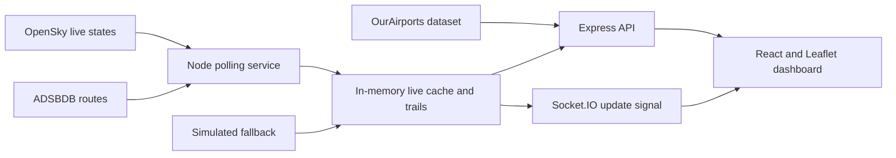

# SkyRadar

SkyRadar is a full-stack real-time aircraft tracking dashboard designed as a CSE portfolio project. It combines live ADS-B aircraft states, callsign-based route enrichment, global airport data, smooth dead-reckoned movement, and a responsive holographic map interface.

## Highlights

- Live aircraft positions from the OpenSky Network
- Smooth aircraft movement between upstream position reports
- Origin, destination, airline, and airport details from ADSBDB
- 49,000+ operational airports from the public-domain OurAirports dataset
- Named airport markers that adapt to the map zoom level
- Selected-flight route visualization and recent position trails
- Callsign, country, and ICAO search with flight-pattern filters
- Browser geolocation, live statistics, responsive mobile layout
- Automatic simulated-data fallback during upstream outages
- Docker-ready production deployment

## Technology

| Layer | Technology |
| --- | --- |
| Frontend | React, Vite, React Leaflet, Socket.IO Client, Lucide |
| Backend | Node.js, Express, Socket.IO |
| Live data | OpenSky Network REST API |
| Route data | ADSBDB public API |
| Airport data | OurAirports public-domain dataset |
| Map tiles | CARTO / OpenStreetMap |

## Quick Start

Requirements: Node.js 22+ and npm.

```bash
npm run install:all
npm run dev
```

Open `http://localhost:5173`. The API runs at `http://localhost:4000`.

Anonymous OpenSky access works without credentials but has stricter limits. Copy `.env.example` to `.env` and add an OpenSky API client for authenticated access.

## Useful Commands

```bash
npm run dev          # Start frontend and API
npm run build        # Create the production frontend
npm run start        # Start the API / production static server
docker compose up --build
```

## User Guide

1. Allow location access to center the map near you.
2. Pan or zoom to load aircraft and airports for that region.
3. Select an aircraft to load its route and frame the full journey.
4. Use the airport and flight-path controls to manage map layers.
5. Use `Ctrl/Cmd + K` to focus search and `Esc` to close aircraft details.
6. Use the orbit control to disable holographic effects on slower devices.

## API

| Endpoint | Description |
| --- | --- |
| `GET /api` | API information |
| `GET /api/health` | Data source and airport-dataset status |
| `GET /api/flights/live` | Aircraft inside optional map bounds |
| `GET /api/flights/:icao24` | Current aircraft, route, and trail |
| `GET /api/flights/:icao24/history` | Recent position history |
| `GET /api/airports` | Airports inside required map bounds |
| `GET /api/analytics/summary` | Aggregate live-flight metrics |

Bounding-box parameters: `lamin`, `lomin`, `lamax`, and `lomax`.

## Architecture



## Data Accuracy

ADS-B transmits aircraft state such as position, heading, altitude, and velocity. It does not transmit origin or destination. Route details are inferred from callsigns and may be unavailable or inaccurate for private, military, cargo, diverted, or unusual flights.

The UI advances aircraft between upstream reports using speed and heading. These interpolated positions improve visual continuity but remain estimates until corrected by the next live state.

## Project Documentation

See [docs/PROJECT_REPORT.md](docs/PROJECT_REPORT.md) for objectives, modules, algorithms, limitations, testing, and viva/demo talking points.

## Troubleshooting

- **Site cannot be reached:** run `npm run dev` and verify ports `5173` and `4000` are free.
- **Demo feed appears:** OpenSky is unavailable or rate-limiting anonymous access.
- **A route is unavailable:** the callsign could not be resolved by ADSBDB.
- **Too many visual effects:** disable the orbit/hologram control.
- **No nearby flights:** zoom out or move to another region.

## License

This student project is available under the MIT License. Third-party data remains subject to each provider's terms and attribution requirements.
